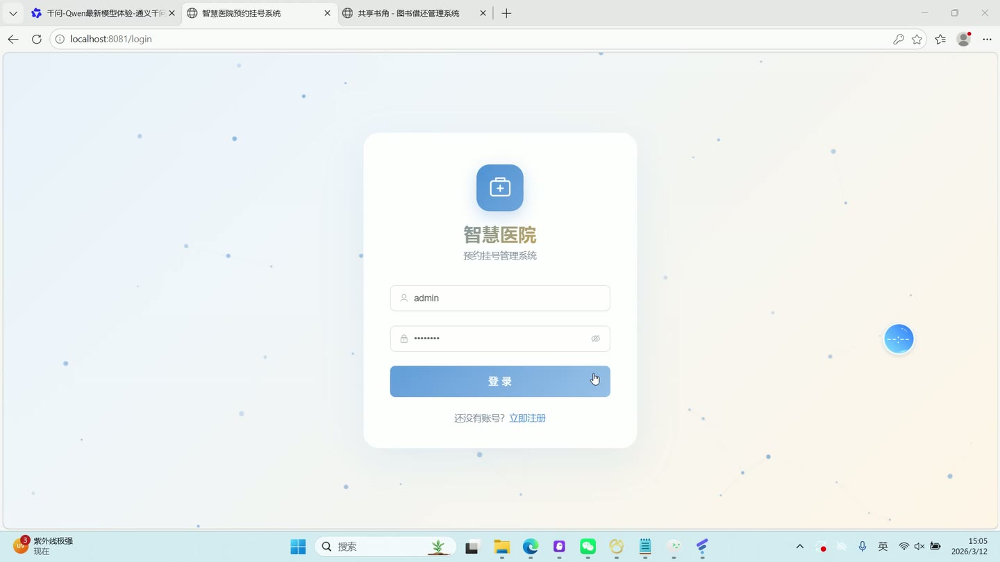
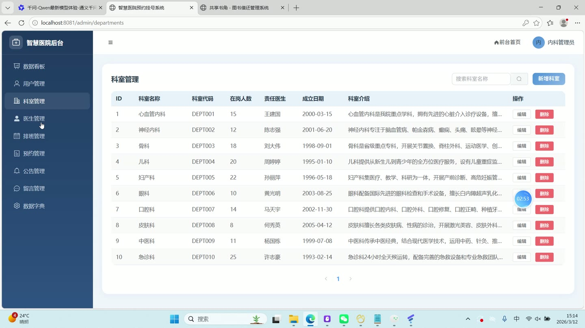
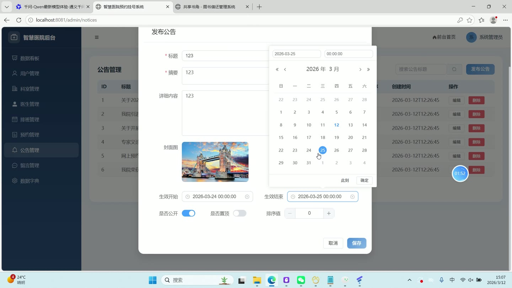
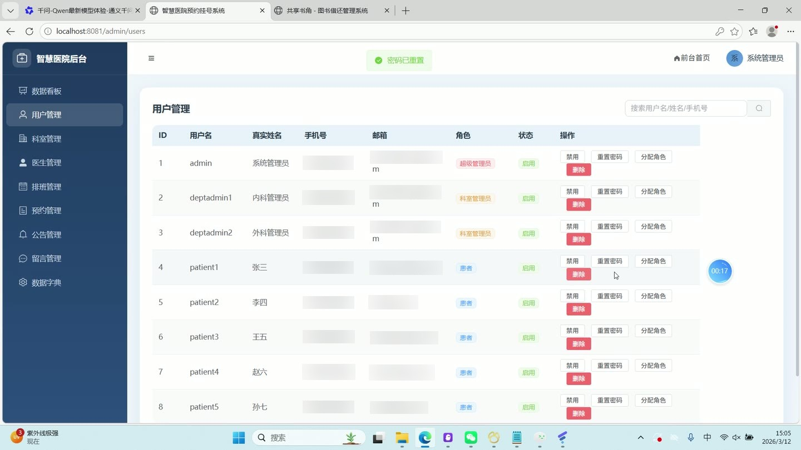
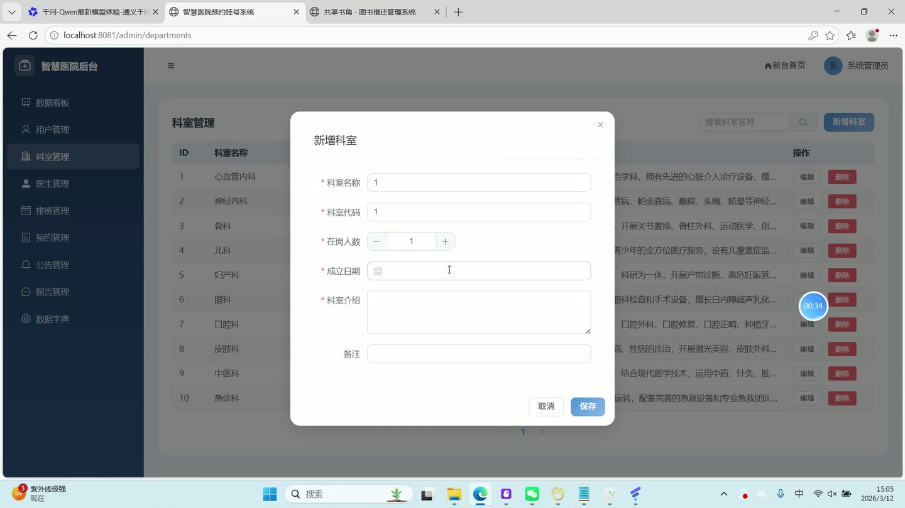
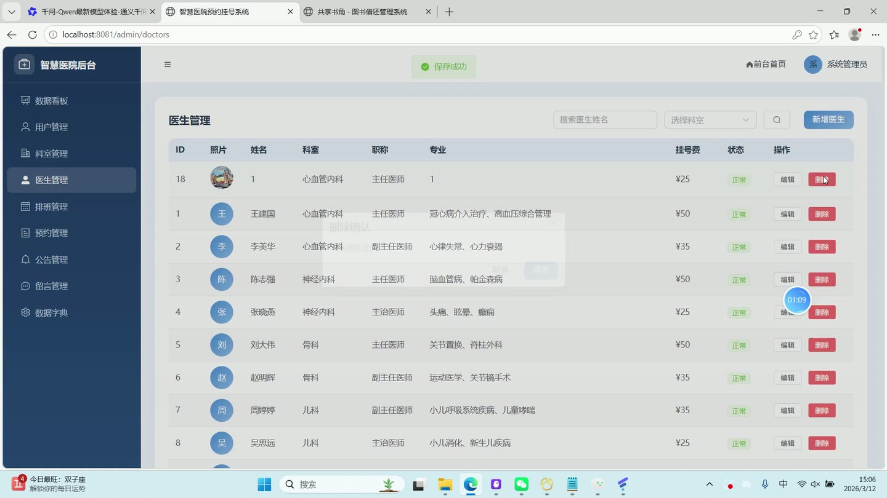

# (附文档)Springboot3+Vue3+MySQL 智慧医院预约挂号系统

**技术栈**：Springboot3、Vue3、MySQL

### 系统简介

智慧医院预约挂号系统采用 SpringBoot3 + Vue3 前后端分离架构，支持患者在线预约挂号、支付与取消，管理员后台管理用户、科室、医生、排班、预约、公告、留言及系统字典。系统内置 JWT 鉴权与角色路由守卫，提供完整的数据统计看板。
 
### 核心功能
 
### 普通用户端

 
- 注册账号（校验用户名唯一性、手机号格式、密码至少6位且非纯数字） 
- 登录（用户名+密码 MD5 验证，返回 JWT Token 及用户角色信息） 
- 浏览科室列表（支持按科室名称关键词搜索分页） 
- 查看科室详情（展示科室名称、代码、编制人数、科室主任、成立日期、简介） 
- 浏览医生列表（支持按姓名、所属科室、职称筛选分页） 
- 查看医生详情（展示姓名、年龄、性别、职称、专长、学历、毕业院校、从业年限、简介、挂号费） 
- 按科室查看医生列表（仅显示启用状态的医生） 
- 查看医生排班（展示未来日期中已启用的排班，按日期和时段升序排列） 
- 创建预约（选择排班时段，自动生成订单号、排队号，扣减号源余量，校验重复预约与过期时段） 
- 支付预约（选择支付方式，更新支付状态、支付时间，生成支付记录与交易流水号） 
- 取消预约（释放号源，已支付自动生成退款记录，标记退款状态） 
- 查看我的预约（按状态筛选，分页展示预约记录，包含医生姓名、科室名称） 
- 查看我的支付记录（分页展示订单号、金额、支付方式、支付状态、交易流水号） 
- 提交留言反馈（校验内容非空且不超过1024字符，自动记录用户真实姓名） 
- 查看我的留言列表（分页展示提交的反馈及管理员回复内容） 
- 浏览公告列表（仅展示已发布且在有效时间范围内的公告，支持关键词搜索） 
- 查看公告详情（标题、摘要、正文、封面图片、发布时间） 
- 查看个人信息（用户名、真实姓名、手机号、邮箱、年龄、性别、头像） 
- 修改个人信息（更新真实姓名、手机号、邮箱、年龄、性别、头像） 
- 修改密码（校验原密码正确性、新密码至少6位且非纯数字）
 
### 管理员端

 
- 登录后台（与普通用户共用登录接口，根据角色路由跳转至后台首页） 
- 查看数据统计仪表盘（今日预约量、注册患者总数、科室总数、医生总数、各科室预约分布、近30天预约趋势、时段分布、总收入） 
- 用户管理（分页列表，支持按用户名/真实姓名/手机号搜索；启用/禁用账号；重置密码为 admin123；修改用户角色；删除用户） 
- 科室管理（分页列表，支持按科室名称搜索；新增科室（校验科室代码唯一性）；编辑科室信息；查看科室详情；删除科室） 
- 医生管理（分页列表，支持按姓名、所属科室、职称筛选；新增医生（自动根据从业起始日期计算工龄）；编辑医生信息；查看医生详情；删除医生） 
- 排班管理（分页列表，支持按医生、日期范围、科室筛选；新增排班（校验同一医生同一日期时段不重复）；批量新增排班（选择医生、时段、号源总数、多个日期）；编辑排班；删除排班） 
- 预约管理（分页列表，支持按订单号/患者姓名关键词搜索、按状态筛选；查看预约详情，包含医生、科室、时段、排队号、挂号费、支付状态） 
- 公告管理（分页列表，支持按标题关键词搜索；新增公告（设置标题、摘要、正文、封面、发布时间范围、是否公开、是否置顶、排序号）；编辑公告；删除公告） 
- 留言反馈管理（分页列表，支持按状态筛选；回复留言（填写回复内容，自动记录回复人ID与回复时间）；删除留言） 
- 系统字典管理（分页列表，支持按字典类型筛选；新增字典项（类型、标签、值、排序、状态、备注）；编辑字典项；删除字典项） 
- 文件上传（支持上传图片/文档，返回可访问的 URL 路径）
 
### 技术栈

 后端框架Spring Boot 3.x ORMMyBatis-Plus（自动分页、逻辑删除） 权限认证JWT（自定义拦截器 + 路由守卫） 前端框架Vue 3（Composition API） 状态管理Vue Router（路由守卫鉴权） 构建工具Vite UI 组件Element Plus 数据库MySQL 8.x 工具库Hutool（MD5 加密）、Jackson（JSON 序列化）
 
### 交付内容

 
- 后端完整源码 
- 前端完整源码 
- 数据库初始化脚本 
- 万字文档

## 界面展示

---

## 获取完整源码 + 万字文档

本仓库为项目介绍页。**完整前后端源码、数据库初始化脚本、万字项目文档**，请加微信 `kangkangcode`，或访问 [codekk.top](http://codekk.top) 获取。

可作课程设计 / 毕业设计参考，支持远程部署调试。